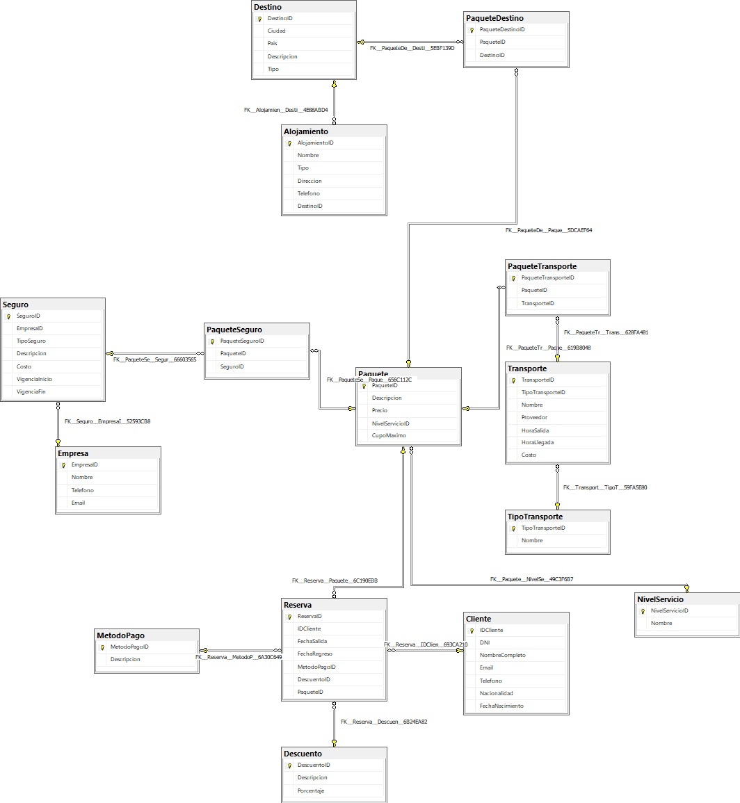

# Agencia de Turismo – Base de Datos Relacional

## 📌 Descripción
Sistema de base de datos para la gestión de una agencia de turismo.
Permite administrar clientes, paquetes turísticos, reservas, seguros,
transportes y destinos, garantizando integridad y normalización hasta 3NF.

## 🧱 Modelo de Datos
- Normalización hasta Tercera Forma Normal (3NF)
- Relaciones N:N resueltas mediante tablas intermedias
- Integridad referencial mediante claves foráneas
- Validaciones con CHECK constraints

## ⚙️ Funcionalidades
- Alta y baja lógica de clientes
- Reserva de paquetes con control de cupo
- Gestión de seguros y transportes
- Stored Procedures para lógica de negocio
- Índices para optimización de consultas

## 🛠️ Tecnologías
- SQL Server (T-SQL)

## 📊 Diagrama ER
El DER refleja la estructura lógica del sistema, incluyendo clientes, reservas, paquetes turísticos, destinos, transportes, seguros y métodos de pago.

📌 Descripción de API REST

API REST desarrollada con FastAPI para la gestión de una agencia de turismo.
Permite administrar paquetes turísticos, reservas y niveles de servicio, integrándose con una base de datos relacional en SQL Server.

El proyecto implementa arquitectura en capas, paginación, validaciones, manejo global de excepciones y testing automatizado.

📦 Funcionalidades API
📋 Paquetes

GET /paquetes

Paginación

Filtros por precio mínimo

Filtro por nivel de servicio

POST /paquetes

Creación de paquete

Status 201

PUT /paquetes/{id}

Actualización de paquete

DELETE /paquetes/{id}

Eliminación de paquete

Status 204 (No Content)

## == IMPORTANTE ==
▶️ Cómo ejecutar el proyecto

Instalar dependencias:

pip install -r requirements.txt

Levantar servidor:
uvicorn app.main:app --reload

Acceder documentación de Swagger:
http://localhost:8000/docs

## 🚀 Próximos pasos
- API REST --> COMPLETADO EL PRIMER VERSIONADO
- Frontend web

